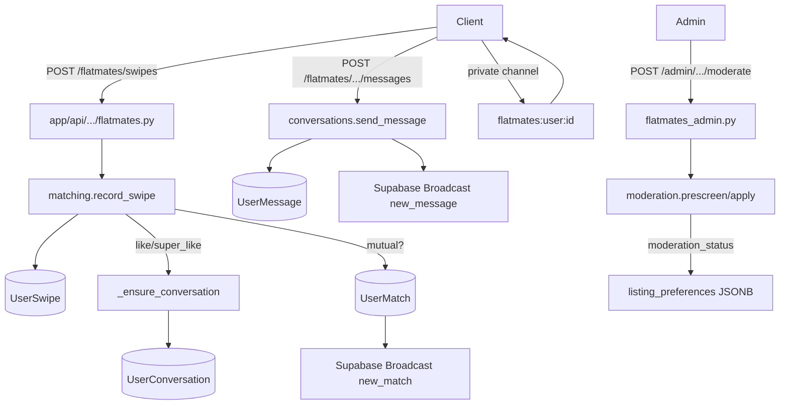

# Flatmates

Active contributors: Saksham, Ravi

The Flatmates module is a swipe-based roommate and PG discovery system layered on top of the property and social models. Users post room listings, swipe on each other, match, chat, exchange QnA answers, and schedule visits, all moderated by an automated prescreen pipeline and an admin moderation workflow. App-wide realtime events flow to clients through Supabase Realtime private Broadcast channels.

## Directory layout

```
app/api/api_v1/endpoints/
├── flatmates.py           # profiles, swipes, matches, conversations, messages, QnA
└── flatmates_admin.py     # moderation queue: approve, reject, request_edit
app/services/flatmates/
├── __init__.py            # re-exports all 7 submodules
├── profiles.py            # profile CRUD, discoverable list, catalogs, bootstrap
├── matching.py            # record_swipe, list_matches, incoming/outgoing likes
├── conversations.py       # _ensure_conversation, messages, QnA, mark_read
├── interactions.py        # profile_view_event, society_tag_vote
├── moderation.py          # prescreen, reports, blocks, stale-listing pause
├── visits.py              # update_visit_status + realtime event queue
├── realtime.py            # Supabase Broadcast publisher + after-commit queue
└── helpers.py             # canonical pair, payload builders, geocoding
app/models/
└── social.py              # UserMatch, UserConversation, UserMessage, UserBlock, UserReport, AppCatalog, MatchQnAAnswer
app/models/enums.py        # SwipeAction, SwipeTargetType, ConversationStatus, etc.
```

## Key abstractions

| Abstraction | File | Role |
|---|---|---|
| `record_swipe` | `app/services/flatmates/matching.py` | Idempotent swipe; creates conversation on like; queues realtime on match |
| `_ensure_conversation` | `app/services/flatmates/conversations.py` | Canonical-pair upsert of `UserConversation` |
| `_canonical_pair` | `app/services/flatmates/helpers.py` | Sorts `(user_one_id, user_two_id)` so pairs are stable |
| `list_discoverable_profiles` | `app/services/flatmates/profiles.py` | Cursor-paginated feed of swipable peers |
| `prescreen_flatmate_listing` | `app/services/flatmates/moderation.py` | Auto prescreen: photo count, suspicious rent, spam patterns |
| `pause_stale_flatmate_listings` | `app/services/flatmates/moderation.py` | Pauses flatmate/PG listings not updated in STALE_LISTING_PAUSE_DAYS (default 60) |
| `EnumStringType` | `app/models/social.py` | TypeDecorator storing enums as strings with DB CHECK constraints |
| `queue_flatmates_realtime_event` | `app/services/flatmates/realtime.py` | After-commit publisher to `flatmates:user:{local_user_id}` Supabase channels |

## How it works

A swipe records a `UserSwipe` row keyed by `(user_id, property_id)` for property targets, or by `(user_id, target_user_id)` for profile targets. Positive actions (`like`, `super_like`) call `_ensure_conversation`, which canonicalises the user pair and upserts a `UserConversation`. When both sides have liked, a `UserMatch` row is created and `new_match` is queued for both users after commit. Messages append to `UserMessage` rows, update `last_message_at` / `last_message_preview`, and queue `new_message` / `conversation_updated` broadcasts.



Moderation runs in two layers. `prescreen_flatmate_listing` runs synchronously on profile create/update and writes `moderation_status` (`pending_review`, `live`, `rejected`) plus prescreen metadata into the property's `listing_preferences` JSONB. It checks `MIN_REVIEW_PHOTO_COUNT` (2), flags rents above `SUSPICIOUS_RENT_CEILING` (1,000,000), and scans descriptions against `_SPAM_PATTERNS` (adult content, illegal substances, commercial spam, off-platform spam). `pause_stale_flatmate_listings` runs on every flatmates endpoint entry and flips listings not updated in `STALE_LISTING_PAUSE_DAYS` (default 60 days) to `paused`. The admin moderation endpoint in `flatmates_admin.py` exposes approve/reject/request_edit actions and applies `REPORT_AUTO_PAUSE_THRESHOLD` (3 reports triggers an auto-pause).

Supabase Realtime private Broadcast is the real-time backbone. The bootstrap response includes the private topic and supported events. The backend publishes to `flatmates:user:{local_user_id}` through the Realtime REST Broadcast API after DB commit. Supabase Realtime Authorization on `realtime.messages` restricts each authenticated user to their own channel. Event types are `new_match`, `new_message`, `conversation_updated`, `visit_updated`, `listing_status_changed`, and `new_notification`.

## Integration points

- **Supabase Realtime**: matching, conversations, visits, listing moderation, and flatmates notifications publish through `app/services/flatmates/realtime.py`.
- **Property model**: flatmate/PG listings are `Property` rows with `property_type` in `PG_FLATMATE_TYPES = {PropertyType.pg, PropertyType.flatmate}`. The `listing_preferences` JSONB column carries moderation status, QnA answers, and metadata.
- **Visits**: `flatmates/visits.py` calls into [Ghar Core](ghar-core.md) visit logic with `visit_context=flatmate_meet` and `_validate_flatmate_visit_context` enforces the canonical pair and an active match/conversation.
- **Push notifications**: `app/services/push_notification.py` dispatches flatmates events (`new_match`, `new_message`, listing approved, visit scheduled) through the [notifications](notifications.md) pipeline with a `route` deep-link data field.
- **Geocoding**: `geocode_listing` in `helpers.py` populates `Property.location` for radius search.

## Entry points for modification

Add new realtime event types by extending `app/services/flatmates/realtime.py`, queuing from the relevant service method, and updating CLAUDE.md and AGENTS.md. New moderation rules belong in `prescreen_flatmate_listing` or `apply_listing_prescreen_metadata`. Conversation and match queries always use the canonical pair to avoid duplicate rows; never query `UserConversation` by unordered user IDs.

## Key source files

| File | Purpose |
|---|---|
| `app/api/api_v1/endpoints/flatmates.py` | REST endpoints |
| `app/api/api_v1/endpoints/flatmates_admin.py` | Moderation endpoints (14 KB) |
| `app/services/flatmates/matching.py` | Swipe + match logic (489 lines) |
| `app/services/flatmates/conversations.py` | Conversation + message CRUD (545 lines) |
| `app/services/flatmates/moderation.py` | Prescreen, reports, blocks (568 lines) |
| `app/services/flatmates/profiles.py` | Profile CRUD + catalogs (516 lines) |
| `app/services/flatmates/helpers.py` | Canonical pair, payload builders, geocoding |
| `app/services/flatmates/interactions.py` | Profile views, society tag votes |
| `app/services/flatmates/visits.py` | Visit status updates + realtime event queue |
| `app/models/social.py` | Social ORM models + `EnumStringType` |
| `app/services/flatmates/realtime.py` | Supabase Broadcast publisher |
| `app/services/push_notification.py` | Flatmates push dispatch |
