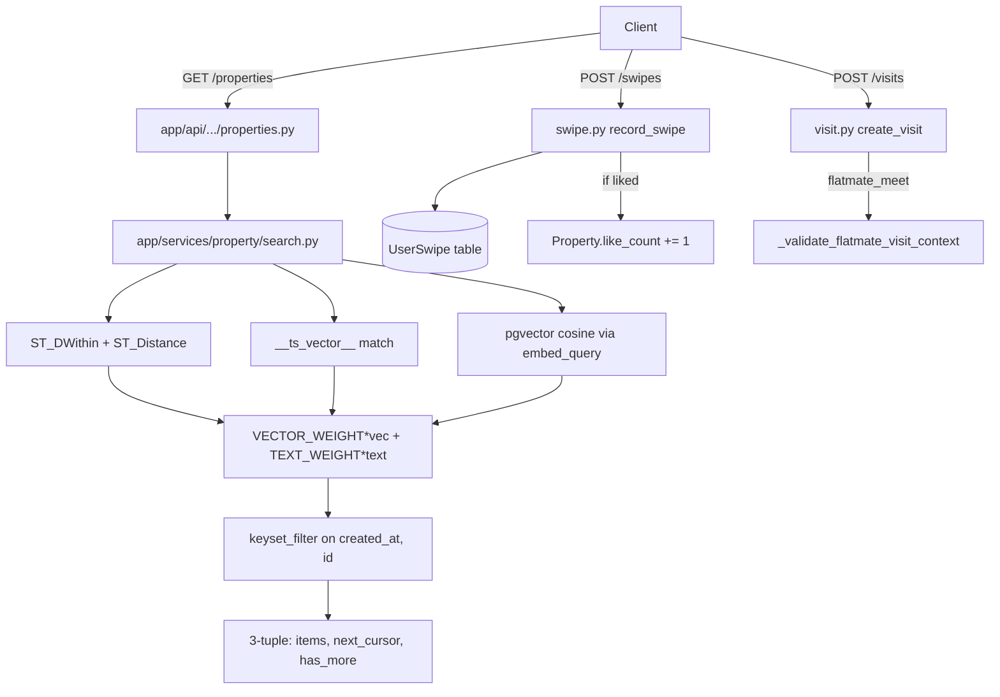

# Ghar Core

Active contributors: Saksham, Ravi

Ghar Core is the property marketplace at the heart of 360 Ghar: listing, discovering, swiping, visiting, and coordinating with agents. It combines PostGIS geospatial radius search, PostgreSQL full-text search (`__ts_vector__`), and pgvector hybrid semantic scoring, all surfaced through cursor-paginated REST endpoints that return the recent 3-tuple shape `(items, next_cursor, has_more)`.

## Directory layout

```
app/api/api_v1/endpoints/
├── properties.py          # list, get, create, update, delete, /me, recommendations
├── swipes.py              # swipe, history, stats, undo, batch unswipe
├── visits.py              # schedule, list, reschedule, cancel, complete
└── agents.py              # agent CRUD, assignment, workload, system stats
app/services/
├── property/
│   ├── crud.py            # create/get/update/delete + keyset paginated list_user_properties
│   ├── search.py          # unified search: geo + FTS + pgvector hybrid
│   ├── recommendations.py # available-property recs with anon cache
│   └── helpers.py         # build_location_wkt, listing contract validation
├── swipe.py               # record_swipe, history, stats, toggle, undo
├── visit.py               # visit CRUD + flatmate-meeting context validation
└── agent/                 # crud, analytics, interactions submodules
app/repositories/
├── property_repository.py
└── property_query_builder.py
app/models/
├── properties.py          # Property, PropertyImage, Amenity, PropertyAmenity, Visit
└── users.py               # User, UserSwipe, Agent
```

## Key abstractions

| Abstraction | File | Role |
|---|---|---|
| `get_unified_properties_optimized` | `app/services/property/search.py` | Single entrypoint for list/search/semantic with geo + FTS + vector hybrid scoring |
| `VECTOR_WEIGHT` / `TEXT_WEIGHT` | `app/services/property/search.py` | Hybrid relevance weights (0.6 / 0.4) |
| `list_user_properties` | `app/services/property/crud.py` | Keyset cursor pagination on `(created_at, id)` for `/properties/me` |
| `get_property_recommendations` | `app/services/property/recommendations.py` | 3-tuple recommendations with 24h anon cache |
| `record_swipe` | `app/services/swipe.py` | Idempotent swipe upsert + like-count increment |
| `create_visit` | `app/services/visit.py` | Visit scheduling with flatmate-meeting context validation |
| `PropertyRepository` | `app/repositories/property_repository.py` | Reusable query builder for property filters |
| `keyset_filter` / `keyset_payload` | `app/schemas/pagination.py` | Cursor encode/decode helpers shared across paginated endpoints |

## How it works

Discovery flows through one optimised query in `search.py`. Location filters compile to `ST_SetSRID(ST_MakePoint(lng, lat), 4326)` and use `ST_DWithin(location, point, radius_m)` for index-backed radius filtering, with `ST_Distance / 1000` projected as `distance_km` for ordering. Text filters go through the property's `__ts_vector__` column. When `embed_query` returns a vector, a hybrid relevance score is computed as `VECTOR_WEIGHT * vector_score + TEXT_WEIGHT * text_score`.



The 3-tuple return shape is the result of the June 2026 cursor-pagination refactor. Service functions fetch `limit + 1` rows to detect `has_more`, slice back to `limit`, and encode the last row's `(created_at, id)` into `next_payload`. Endpoints wrap the result with `build_cursor_page` from `app/schemas/pagination.py`.

Swipes are idempotent: `record_swipe` looks up an existing `UserSwipe` row by `(user_id, property_id)` and updates it in place, only incrementing `Property.like_count` on the first like transition. If the property has been deleted, the endpoint silently returns success to avoid client errors. Visits support both `property_tour` and `flatmate_meet` contexts; the latter requires a canonical pair `(user_one_id, user_two_id)` and either an existing `UserConversation` or `UserMatch`.

## Integration points

- **MCP servers**: discovery, visit, and owner tools in `app/mcp/user/discovery.py`, `visits.py`, `owner.py` call the same service functions. The [AI agent](ai-agent.md) guest tools wrap `get_unified_properties_optimized`.
- **Cache**: `PropertyCacheManager` from [core cache](../systems/cache-subsystem.md) caches property detail and anonymous recommendations (24h TTL on `recs:anon:v1:l{limit}`).
- **Flatmates realtime**: visit status changes in flatmate context queue `visit_updated` via the [flatmates realtime publisher](../systems/core-cross-cutting.md).
- **Vector sync**: `property_embeddings` rows are kept in sync by the [vector sync scheduler](../systems/vector-search.md).
- **Auth**: `get_current_user_optional` lets anonymous users browse; `get_current_active_user` is required for swipes, visits, and the `/me` endpoint.

## Entry points for modification

Add a new filter by extending `UnifiedPropertyFilter` in `app/schemas/property.py` and the predicate construction in `get_unified_properties_optimized`. New listing endpoints should return the 3-tuple shape and wrap with `build_cursor_page` to stay consistent with the pagination refactor. Owner-scoped flows must go through `pm_authz` when they touch PM entities.

## Key source files

| File | Purpose |
|---|---|
| `app/api/api_v1/endpoints/properties.py` | REST endpoints (19.7 KB) |
| `app/api/api_v1/endpoints/swipes.py` | Swipe endpoints (8.3 KB) |
| `app/api/api_v1/endpoints/visits.py` | Visit endpoints (9.3 KB) |
| `app/api/api_v1/endpoints/agents.py` | Agent endpoints (13.3 KB) |
| `app/services/property/search.py` | Unified search (708 lines) |
| `app/services/property/crud.py` | CRUD + keyset pagination (649 lines) |
| `app/services/property/recommendations.py` | Recommendations + anon cache |
| `app/services/swipe.py` | Swipe service (390 lines) |
| `app/services/visit.py` | Visit service (547 lines) |
| `app/services/agent/` | Agent service package |
| `app/repositories/property_repository.py` | Reusable query builder |
| `app/schemas/pagination.py` | Cursor helpers shared by all paginated endpoints |
