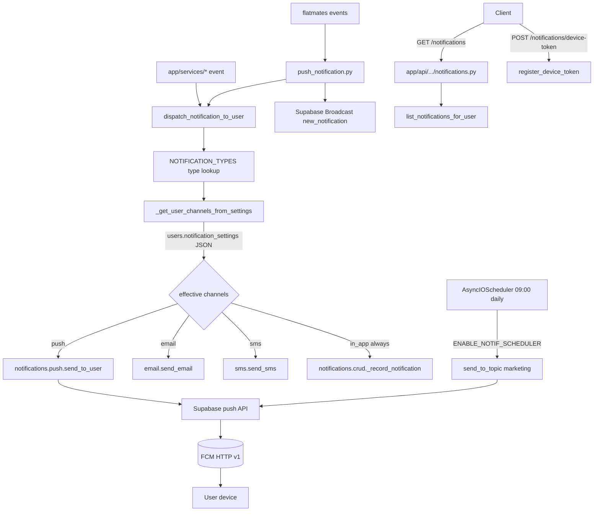

# Notifications

Active contributors: Saksham, Ravi

The notifications system is a multi-channel dispatch pipeline that delivers push (FCM), email, SMS, and in-app notifications. A central type registry in `notification_config.py` declares every notification type with its category, priority, allowed channels, TTL, and frequency cap; the dispatcher computes the effective channel set per user based on their `notification_settings` JSON; and a shared APScheduler job fires daily marketing pushes.

## Directory layout

```
app/services/
├── notification_config.py         # NOTIFICATION_TYPES registry + config dataclasses
├── notification_dispatcher.py     # dispatch_notification_to_user + segment dispatch
├── notification_scheduler.py      # daily marketing push cron registration
├── push_notification.py           # flatmates-specific push helpers
├── email.py                       # send_email (SMTP/transactional provider)
├── sms.py                         # send_sms (SMS gateway)
└── notifications/
    ├── __init__.py                # re-exports crud, fcm, helpers, push
    ├── crud.py                    # _record_notification, list_notifications_for_user, mark_opened
    ├── fcm.py                     # FCM access token, build_message, send_message
    ├── helpers.py                 # _NOTIFICATION_EXECUTOR thread pool, _supa client, _augment_data_with_meta
    └── push.py                    # register_device_token, send_to_user, send_to_token, send_to_topic, send_bulk
app/api/api_v1/endpoints/
└── notifications.py               # list, mark read, register/unregister device token
```

## Key abstractions

| Abstraction | File | Role |
|---|---|---|
| `NOTIFICATION_TYPES` | `app/services/notification_config.py` | Dict of `NotificationTypeConfig` keyed by type string |
| `NotificationTypeConfig` | `app/services/notification_config.py` | `key, category, priority, allowed_channels, default_ttl_seconds, frequency_cap, marketing_opt_in_key` |
| `NotificationChannel` | `app/services/notification_config.py` | Enum: `in_app, push, email, sms` |
| `NotificationCategory` | `app/services/notification_config.py` | Enum: `transactional, system, marketing` |
| `FrequencyCap` | `app/services/notification_config.py` | `per_day, per_week` caps per user per type |
| `dispatch_notification_to_user` | `app/services/notification_dispatcher.py` | Single-user dispatch: resolves channels, sends, records |
| `_get_user_channels_from_settings` | `app/services/notification_dispatcher.py` | Computes effective channel set from `users.notification_settings` JSON |
| `send_to_user` / `send_to_topic` / `send_bulk` | `app/services/notifications/push.py` | FCM push dispatch via Supabase push API |
| `_access_token` / `build_message` / `send_message` | `app/services/notifications/fcm.py` | FCM OAuth2 token + message construction + HTTP send |
| `_record_notification` | `app/services/notifications/crud.py` | Persists in-app notification row |
| `register_device_token` / `unregister_device_token` | `app/services/notifications/push.py` | Device token lifecycle |
| `_NOTIFICATION_EXECUTOR` | `app/services/notifications/helpers.py` | Thread pool for non-blocking sends |

## How it works

The type registry is the source of truth. `NOTIFICATION_TYPES` maps each logical type (e.g. `booking_confirmed`, `payment_failed`, `chat_message`, `password_changed`, `security_alert`) to a `NotificationTypeConfig` with its category (`transactional`, `system`, `marketing`), priority (`low`, `normal`, `high`, `critical`), allowed channels, default TTL, and optional `FrequencyCap` and `marketing_opt_in_key`. Adding a new notification type requires an entry here — the [AGENTS.md](../../AGENTS.md) rules make this explicit.

Dispatch flows through `dispatch_notification_to_user`. It looks up the `NotificationTypeConfig`, calls `_get_user_channels_from_settings` to intersect the type's `allowed_channels` with the user's `notification_settings` JSON (global `push_notifications`, `email_notifications`, `sms_notifications` toggles plus marketing-specific `promotional_emails` / `promotional_push` / `categories.promotions` flags and optional per-type opt-in keys). The in-app channel is always enabled. For each resulting channel, the dispatcher calls `send_email`, `send_sms`, or the push pipeline, and always records an in-app notification row via `_record_notification`.



Push uses Firebase Cloud Messaging through Supabase's push API. `notifications/fcm.py` mints an OAuth2 access token for the `FCM_SCOPE` using the Firebase service account credentials (`_fcm_credentials`, `_fcm_token_expiry`), `build_message` constructs the FCM HTTP v1 message, and `send_message` performs the HTTP send. `push.py` exposes `send_to_user` (resolves device tokens for the user), `send_to_token` (direct), `send_to_topic` (broadcast), and `send_bulk` (batch). Device tokens are registered and unregistered through the `/api/v1/notifications/device-token` endpoint.

The flatmates module has its own thin push helper in `push_notification.py` that wraps `dispatch_notification_to_user` for flatmates events (`new_match`, `new_message`, listing approved, visit scheduled/confirmed) and queues a Supabase Realtime `new_notification` broadcast to the user's private flatmates channel.

The scheduler in `notification_scheduler.py` registers a daily 09:00 marketing push job on the shared `AsyncIOScheduler` if `ENABLE_NOTIF_SCHEDULER` is true. It calls `send_to_topic("marketing", ...)` with a `promotion_generic` type key. In serverless mode the scheduler is skipped.

## Integration points

- **Type registry contract**: every new notification type must be added to `NOTIFICATION_TYPES` in `notification_config.py` per [AGENTS.md](../../AGENTS.md).
- **Flatmates realtime**: push dispatch also queues `new_notification` events through `app/services/flatmates/realtime.py` for real-time in-app delivery.
- **User settings**: `users.notification_settings` JSON drives per-user channel selection; the dispatcher tolerates both 360 Ghar and Stays app shapes.
- **Schedulers**: the marketing push job registers on the shared `AsyncIOScheduler` (see [infrastructure](../systems/infrastructure.md)).
- **Supabase**: FCM dispatch goes through the Supabase push API; the `_supa` helper in `notifications/helpers.py` provides the client.
- **Flatmates**: `app/services/push_notification.py` is the flatmates-specific entry point.
- **Bookings**: `app/api/api_v1/endpoints/bookings.py` calls `dispatch_notification_to_user` directly for `booking_confirmed` and related events.

## Entry points for modification

Add a new notification type by registering it in `NOTIFICATION_TYPES` (with category, priority, allowed channels, TTL, optional frequency cap and marketing opt-in key), then calling `dispatch_notification_to_user` from the service method after the DB commit. New channels require extending `NotificationChannel`, the dispatcher's send switch, and `_get_user_channels_from_settings`. Frequency cap enforcement belongs in the dispatcher before send. Update CLAUDE.md and AGENTS.md when adding types or channels.

## Key source files

| File | Purpose |
|---|---|
| `app/services/notification_config.py` | Type registry + config dataclasses (364 lines) |
| `app/services/notification_dispatcher.py` | Multi-channel dispatch (284 lines) |
| `app/services/notification_scheduler.py` | Daily marketing push cron |
| `app/services/notifications/crud.py` | In-app notification CRUD |
| `app/services/notifications/fcm.py` | FCM token + message + send |
| `app/services/notifications/push.py` | Supabase push dispatch + device tokens (11.8 KB) |
| `app/services/notifications/helpers.py` | Thread pool, Supabase client, type config lookup |
| `app/services/push_notification.py` | Flatmates push helpers (239 lines) |
| `app/services/email.py` | Email send |
| `app/services/sms.py` | SMS send |
| `app/api/api_v1/endpoints/notifications.py` | Notification REST endpoints (11.5 KB) |
