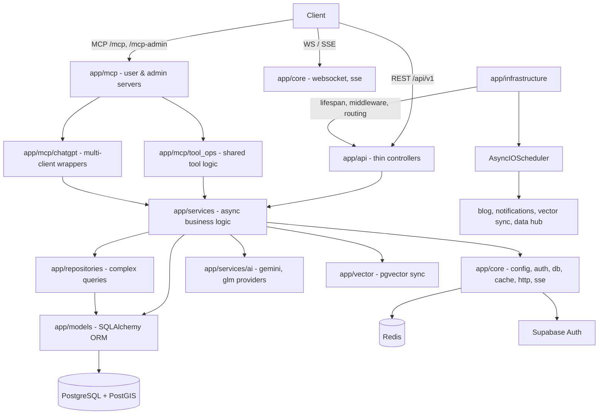
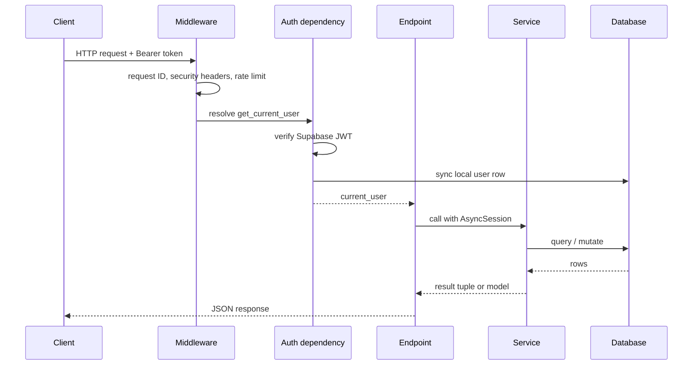

# Architecture

360 Ghar is a layered FastAPI application where HTTP endpoints stay thin, business logic lives in async services, and cross-cutting concerns (config, auth, db, cache, http, sse, logging) sit in `app/core/`. A single composition root in `app/factory.py` wires the app together via `app/infrastructure/`, and the same service layer is reused by REST, MCP, and the AI agent so business rules are never duplicated.

## Layered structure

From top to bottom:

- `app/infrastructure/` — composition root. Owns lifespan startup/shutdown, middleware registration, exception handlers, MCP HTTP app construction, route mounting, and the shared scheduler. `app/factory.py` is a thin wrapper that calls into this module.
- `app/api/` — REST controllers under `api_v1/endpoints/` plus shared auth dependencies under `api_v1/dependencies/`. Endpoints validate input, enforce auth, and delegate to services.
- `app/services/` — the largest layer. Async-first service classes that hold business rules. Includes domain packages (`flatmates/`, `data_hub/`, `ai/`, `ai_agent/`, `blog_service/`, `notifications/`, `tour/`, `tour_ai/`, `property/`, `pm_*`).
- `app/repositories/` — complex queries factored out of services (`BaseRepository`, `PropertyRepository`, `PropertyQueryBuilder`).
- `app/models/` — 68 ORM tables across 18 model files, plus 50+ enums in `enums.py`.
- `app/core/` — cross-cutting: `config.py`, `auth.py`, `database.py`, `cache/`, `http.py`, `sse.py`, `logging.py`, `db_resilience.py`, `websocket.py`, `exceptions.py`, `utils.py`.
- `app/vector/` — pgvector embedding store, sync scheduler, and backfill.
- `app/mcp/` — MCP servers and shared tool logic (see below).

## Request flow

A REST request passes through middleware (request ID, security headers, rate limit, trailing slash), then an auth dependency that verifies the Supabase JWT and syncs the local user row, then the endpoint which delegates to a service holding an `AsyncSession`. Services return either ORM models or 3-tuples `(items, next_cursor, has_more)` for paginated list endpoints.

## MCP architecture

The backend exposes two MCP servers from a single FastAPI app. Both use `AppsSDKFastMCP` (extends FastMCP 3.0.1) with OAuth 2.1 + PKCE, and both call into the same service layer via `app/mcp/tool_ops/`. The AI agent in `app/services/ai_agent/` also calls `tool_ops` through `tool_bridge.py`, so tool behavior is defined once.

| Mount | Server | Audience |
|---|---|---|
| `/mcp` | `ghar360-user` | Owners, tenants, seekers, guests |
| `/mcp-admin` | `ghar360-admin` | Agents, platform admins |

Transport is streamable HTTP (stateless, binary JSON-RPC), not SSE. The protocol version advertised is `2025-11-25`, with the `io.modelcontextprotocol/ui` experimental capability signaling support for interactive HTML widgets. Widget resources are registered with stable `ui://widget/*.html` URIs plus content-hashed `?v=<hash>` aliases, and tool metadata uses a dual-metadata strategy: standard MCP keys (`ui.resourceUri`, `ui.visibility`) alongside OpenAI-compatible aliases (`openai/outputTemplate`, `openai/widgetAccessible`). The bridge in `chatgpt-widgets/src/utils/bridge.ts` detects the host at load time and adapts.

## Realtime and streaming

Two realtime channels run alongside REST:

- **WebSocket** (`app/core/websocket.py`) — job progress and notification streams at `ws://.../ws/jobs/{job_id}` and `ws://.../ws/notifications`.
- **Flatmates realtime** (`app/services/flatmates/realtime.py`) — Supabase private Broadcast publisher. Services queue events on the SQLAlchemy session and publish after commit to `flatmates:user:{local_user_id}`. Event types: `new_match`, `new_message`, `conversation_updated`, `visit_updated`, `listing_status_changed`, `new_notification`.

Streaming endpoints release the main-pool DB session before streaming and use the background pool (`get_bg_db`) for any tool calls, so held-open connections don't consume request-pool slots.

## Background work

A single `AsyncIOScheduler` from `app/infrastructure/scheduler.py` is registered in lifespan. Four job families attach to it: blog auto-publish, notifications, vector sync, and data hub scraping. No module creates its own scheduler instance. When `SERVERLESS_ENABLED=True`, schedulers are skipped entirely, both DB engines switch to `NullPool`, and the cache falls back to in-memory so the app can scale to zero behind Supabase transaction pooling.

## Database and storage

PostgreSQL with PostGIS handles geospatial queries (`ST_DWithin`, `ST_Distance`), full-text search via a `__ts_vector__` column on properties, and semantic search via the `property_embeddings` table (pgvector). Cloudinary stores all media, organized under `360ghar/` folders by content type (avatars, properties, tours, blog covers, documents). Image uploads go through `optimize_for_web()` in `app/services/image_processing.py` before upload.

## Further reading

- [Getting started](getting-started.md) for local setup.
- [Patterns and conventions](../how-to-contribute/patterns-and-conventions.md) for the rules the architecture enforces.
- [Glossary](glossary.md) for domain terms used above.
