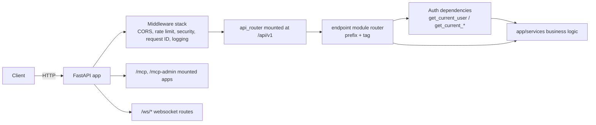

# API layer

Active contributors: Saksham, Ravi

The REST API layer is the primary public surface of the backend, exposing 333 endpoints across 38 endpoint modules under `/api/v1`. Endpoints are thin controllers that validate input via Pydantic schemas, enforce auth through shared dependencies, and delegate business logic to `app/services/`. Router composition lives in `app/api/api_v1/api.py`, with mount registration in `app/infrastructure/routing.py` and the app factory in `app/factory.py`.

## Directory layout

```
app/
├── api/
│   ├── api_v1/
│   │   ├── api.py                       # Router composition (prefix/tags per module)
│   │   ├── dependencies/
│   │   │   └── auth.py                  # get_current_user, get_current_agent, get_current_admin, SSE variant
│   │   └── endpoints/                   # 38 endpoint modules
│   │       ├── agent_chat.py            # AI agent chat (auth + public)
│   │       ├── agents.py
│   │       ├── ai.py
│   │       ├── amenities.py
│   │       ├── auth.py
│   │       ├── blog.py
│   │       ├── bookings.py
│   │       ├── core.py                  # Bugs, pages, app versions, FAQs
│   │       ├── custom_domains.py
│   │       ├── dashboard.py
│   │       ├── data_hub/                # Bank auctions, RERA, circle rates, etc.
│   │       ├── design_studio.py
│   │       ├── flatmates.py
│   │       ├── flatmates_admin.py
│   │       ├── floor_plans.py
│   │       ├── hotspots.py
│   │       ├── notifications.py
│   │       ├── oauth/                   # MCP OAuth 2.1 endpoints
│   │       ├── payments.py
│   │       ├── pm_*.py                  # 12 property management modules
│   │       ├── properties.py
│   │       ├── public.py                # Public tour viewing
│   │       ├── scenes.py
│   │       ├── swipes.py
│   │       ├── tours.py
│   │       ├── upload.py
│   │       ├── users.py
│   │       ├── vastu.py
│   │       ├── visits.py
│   │       ├── websocket.py
│   │       └── webhooks/
│   └── share.py                         # Social share preview endpoints
└── infrastructure/
    └── routing.py                        # Mounts REST, WS, share, OAuth, MCP routes
```

## Key abstractions

| Abstraction | Location | Purpose |
|---|---|---|
| `api_router` | `app/api/api_v1/api.py` | Single `APIRouter` that all endpoint modules attach to with a prefix and tag |
| `create_app` | `app/factory.py` | App factory that builds the FastAPI instance, OpenAPI tags, lifespan, middleware, MCP apps |
| `register_routes` | `app/infrastructure/routing.py` | Mounts `api_router` at `API_V1_STR`, plus WS, share, OAuth well-known, and the two MCP apps |
| `OPENAPI_TAGS` | `app/factory.py` | Tag descriptions used by Swagger/Redoc grouping |
| Auth dependencies | `app/api/api_v1/dependencies/auth.py` | `get_current_user`, `get_current_user_optional`, `get_current_active_user`, `get_current_cached_active_user`, `get_current_agent`, `get_current_admin` |

## How it works



Each endpoint module defines its own `APIRouter` and is included by `api_router` with a `prefix` and `tags=[...]`. The tags mirror the entries in `OPENAPI_TAGS` so Swagger groups operations by domain (properties, bookings, pm-rent, data-hub, and so on). A `/api/v1/health` route redirects to the root `/health` endpoint with a 307.

The factory mounts `api_router` at `settings.API_V1_STR` (default `/api/v1`), then adds the websocket router, the share preview router, the OAuth well-known routers, and the two MCP sub-apps at `/mcp` and `/mcp-admin`. `redirect_slashes=False` plus a trailing-slash middleware normalizes paths.

## Integration points

- **Auth dependencies** call `app/core/auth.verify_supabase_token` and `app/services/user.get_or_create_user_from_supabase` to resolve a bearer token into a `User` row. See [core-cross-cutting](core-cross-cutting.md).
- **Cached flatmates auth** (`get_current_cached_active_user`) verifies the Supabase JWT locally/remotely, then uses a short-lived `supabase_sub -> local user` snapshot cache to reduce repeated DB syncs on flatmates burst paths.
- **MCP servers** share the OAuth infrastructure at `/mcp/oauth/*` and well-known endpoints. See [features/mcp-servers](../features/mcp-servers.md).
- **Services** are imported lazily inside endpoints to keep the import graph lean.

## Entry points for modification

- Add a new endpoint module under `app/api/api_v1/endpoints/`, then import and include it in `app/api/api_v1/api.py` with a prefix and tag. Add the tag description to `OPENAPI_TAGS` in `app/factory.py`.
- Tighten rate limits on a sensitive route with `EndpointRateLimiter` (see `app/middleware/rate_limit.py`); the global limit is 500 req/min per IP.
- For high-burst authenticated flatmates read paths, prefer `get_current_cached_active_user` when only local user id/status/role is needed.

## Key source files

| File | Role |
|---|---|
| `app/factory.py` | App factory, OpenAPI tag definitions, lifespan wiring |
| `app/api/api_v1/api.py` | Router composition, health redirect |
| `app/api/api_v1/dependencies/auth.py` | Auth dependencies (user, agent, admin, SSE, optional) |
| `app/infrastructure/routing.py` | REST, WS, share, OAuth, MCP mount registration |
| `app/api/share.py` | Social share preview endpoints |
| `app/api/api_v1/endpoints/websocket.py` | WebSocket routes for jobs and notifications |
