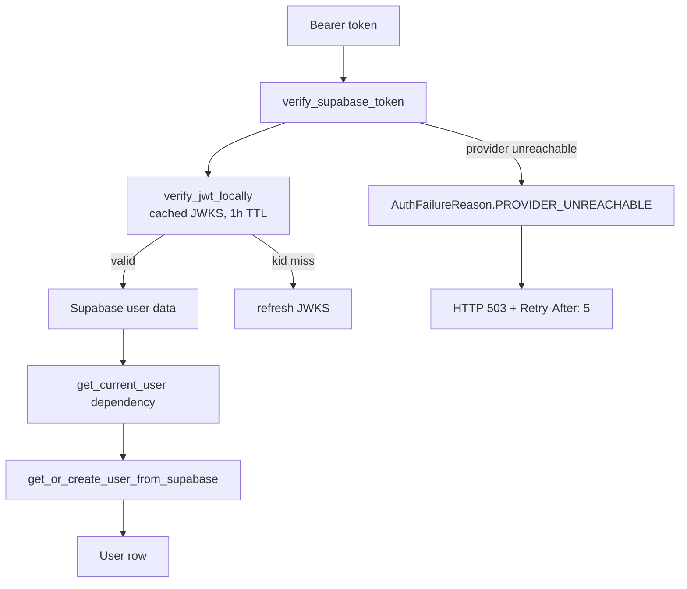

# Core cross-cutting concerns

Active contributors: Saksham, Ravi

The `app/core/` package holds cross-cutting concerns that every layer depends on: configuration, authentication, the async database engine, shared HTTP clients, the SSE event bus, structured logging, JWT verification, DB resilience retry, custom exceptions, the WebSocket manager, and small utilities. None of these modules import from `app/api`, `app/services`, or `app/infrastructure` (the request ID context was moved out of infrastructure into `core/logging` precisely to break that cycle), so `app/core/` forms a stable base that the rest of the app builds on.

## Directory layout

```
app/core/
├── config.py            # Settings (Pydantic BaseSettings)
├── auth.py              # Supabase token verification, admin user ops
├── jwt_verification.py  # Local JWKS-based JWT verification + token cache
├── database.py          # Async engine, bg engine, session factories, Base
├── http.py              # 4 shared httpx.AsyncClient singletons
├── sse.py               # SSEEventBus per-user pub/sub
├── logging.py           # Structured logging, request ID context var, filters
├── db_resilience.py     # Transient error detection + retry-with-rollback
├── exceptions.py        # BaseAPIException hierarchy
├── websocket.py         # ConnectionManager for job/user WS
├── utils.py             # utc_now, make_tz_aware
├── constants.py         # Vision provider defaults, valid providers
└── cache/               # See cache-subsystem.md
```

## Key abstractions

| Abstraction | Location | Purpose |
|---|---|---|
| `Settings` | `app/core/config.py` | Pydantic settings loaded from env files per environment |
| `verify_supabase_token` | `app/core/auth.py` | Resolve a bearer token to Supabase user data, with 503 on provider outage |
| `verify_jwt_locally` | `app/core/jwt_verification.py` | Verify JWT signature/claims via cached JWKS, avoiding per-request HTTP |
| `engine` / `bg_engine` | `app/core/database.py` | Main and background async engines, NullPool in serverless mode |
| `AsyncSessionLocal` / `AsyncSessionLocalBG` | `app/core/database.py` | Session factories for request and background work |
| Shared httpx clients | `app/core/http.py` | `get_scraper_client`, `get_blog_client`, `get_general_client`, `get_supabase_auth_http_client` |
| `Flatmates realtime publisher` | `app/services/flatmates/realtime.py` | Supabase private Broadcast publisher with after-commit queue |
| `SSEEventBus` / `sse_bus` | `app/core/sse.py` | Legacy per-user pub/sub for non-flatmates streaming surfaces |
| `execute_with_transient_retry` | `app/core/db_resilience.py` | One retry with rollback on transient DB errors; fast-fail on pool exhaustion |
| `BaseAPIException` | `app/core/exceptions.py` | Standardized `{error: {code, message, details}}` exception hierarchy |
| `ConnectionManager` / `manager` | `app/core/websocket.py` | Job and user WebSocket connection registry |

## How it works

### Configuration

`Settings` extends Pydantic's `BaseSettings` and loads from environment-specific files (`.env.dev`, `.env.test`, `.env.prod`). It holds core settings (API prefix, secret, version, environment, Sentry), serverless mode, public URLs, CORS origins (with a `CORS_ORIGINS_STR` override), database pool tuning, Redis, AI provider keys, notification settings, and feature flags. The canonical import is `from app.config import settings` (the `app/config/` re-export package).

### Authentication



`verify_supabase_token` first tries local JWT verification via `verify_jwt_locally`, which caches the JWKS for an hour and refreshes on a `kid` miss, with a short-TTL positive token cache (60s, max 5000 entries) to avoid re-verifying identical tokens. If local verification fails it falls back to Supabase introspection. Network errors are classified by `AuthFailureReason`: `PROVIDER_UNREACHABLE` maps to HTTP 503 with `Retry-After: 5` (so clients can distinguish a Supabase outage from a bad token), while other failures map to 401. The dependency layer in `app/api/api_v1/dependencies/auth.py` calls `get_or_create_user_from_supabase` to sync the local `User` row.

### Database

`app/core/database.py` creates two async engines. The main engine (`engine`) serves HTTP/MCP traffic; the background engine (`bg_engine`, application name `360ghar_bg`) serves schedulers and SSE streams. Both use `prepare_threshold=None` for Supabase/PgBouncer compatibility. When `SERVERLESS_ENABLED=True`, both engines use `NullPool` so no persistent connections generate outbound packets that would prevent Railway scale-to-zero (trade-off: 10-50ms added latency per request). Production Supabase pooler URLs must use transaction pooling on port `6543`; startup rejects session-pooler URLs on port `5432` and unknown Supabase pooler ports in production. In non-serverless development mode, app-side pool defaults are intentionally small (`4 + 0` main, `1 + 0` background) to stay below small Supabase session-pool caps. `Base` is the `DeclarativeBase` all models inherit from. Session factories `AsyncSessionLocal` and `AsyncSessionLocalBG` produce `AsyncSession` objects.

### Shared HTTP clients

`app/core/http.py` provides four lazily-created `httpx.AsyncClient` singletons for connection reuse. Creating a fresh client per request allocates a new SSL context, DNS resolver, and connection pool, then tears it all down — the shared clients avoid that. Per-request `timeout=` overrides the client default.

| Client | Default timeout | Max connections | Keepalive | Used by |
|---|---|---|---|---|
| scraper | 60s | 10 | 3 | data-hub scrapers, jamabandi |
| blog | 120s | 5 | 2 | Perplexity, SerpAPI |
| general | 60s | 5 | 2 | image downloads, geocoding, OAuth metadata |
| supabase_auth_http | 10s | 10 | 5 | token verification, admin user ops |

`close_all_clients()` is called from lifespan shutdown. Services must use these clients instead of creating ephemeral `async with httpx.AsyncClient()` blocks.

### Flatmates realtime

Flatmates app-wide realtime uses Supabase Realtime private Broadcast channels. Services call `queue_flatmates_realtime_event` from `app/services/flatmates/realtime.py`; events are stored on the SQLAlchemy session and published only after commit to `flatmates:user:{local_user_id}`. The Supabase migration `20260703000000_flatmates_realtime_authorization.sql` adds a `realtime.messages` RLS policy so an authenticated user can subscribe only to their own channel.

### SSE event bus

`SSEEventBus` in `app/core/sse.py` remains available for non-flatmates streaming surfaces. It maps `user_id` to a list of `asyncio.Queue` objects (one per active SSE response). `emit` is non-blocking: when a queue is full it drops the oldest item and pushes the new one. Every 10 emits the bus reaps dead queues (full for 3 consecutive cycles, or inactive for 30 minutes). A global subscriber cap of 500 prevents unbounded growth.

### Logging

`app/core/logging.py` defines a request ID `ContextVar` (`_current_request_id`), a `RequestIDFilter` that injects the request ID into log records, a `ColorFormatter` for terminal output, and helpers `set_request_id` / `reset_request_id` / `get_request_id`. The request ID middleware sets the context var at request start and resets it in a `finally` block via `reset_request_id(token)`. `app/infrastructure/request_context.py` re-exports these helpers so infrastructure code does not need to import directly from `core/logging` (and so the cycle that previously existed is broken).

### DB resilience

`execute_with_transient_retry(session, operation, operation_name=...)` runs an async operation once; on a transient DB error (disconnection, timeout, invalidated connection, or messages matching `connection to database closed` / `unable to check out connection from the pool` / specific error codes) it rolls back and invalidates the session, sleeps a short jittered delay, and retries once. Pool exhaustion (`QueuePool limit`, code `3o7r`) is explicitly not retried because retrying holds the session open and makes the capacity problem worse — it fails fast instead.

### Exceptions

`BaseAPIException` extends `HTTPException` and defines the standardized error payload shape `{error: {code, message, details?}}`. Subclasses set `status_code`, `error_code`, `detail`, and optional `headers`. The hierarchy covers `NotFoundException`, `UnauthorizedException`, `ForbiddenException`, `ValidationException`, `ConflictException`, `BadRequestException`, `RateLimitException`, `ServiceUnavailableException`, `ExternalServiceError`, `StorageException`, plus domain-specific ones (`PropertyNotFoundException`, `UserNotFoundException`, `BookingConflictError`, etc.). The infrastructure exception handlers serialize these consistently.

### WebSockets

`ConnectionManager` in `app/core/websocket.py` tracks two registries: `job_connections` (job_id to a set of websockets, for AI job progress) and `user_connections` (user_id to a set of websockets, for notifications). It exposes `connect_job`/`connect_user`, `disconnect_*`, `send_job_update`, `send_user_notification`, and `broadcast_job_completion`/`broadcast_job_error`. Dead connections are cleaned up on send failure. A global `manager` instance is shared across the app.

## Integration points

- **API dependencies** call `verify_supabase_token` and use `get_db` / `get_bg_db`. See [api-layer](api-layer.md).
- **Infrastructure lifespan** initializes the cache, engines, HTTP clients, scheduler, and shuts them all down. See [infrastructure](infrastructure.md).
- **Services** use `AsyncSession`, the shared HTTP clients, flatmates realtime publishing, and `execute_with_transient_retry`. See [services-layer](services-layer.md).
- **Cache** subsystem lives under `app/core/cache/`. See [cache-subsystem](cache-subsystem.md).

## Entry points for modification

- New setting: add it to `Settings` in `app/core/config.py` and document the env var.
- New shared HTTP client domain: add a singleton and a `close_*` hook in `app/core/http.py`, call it from `close_all_clients`, and document the client in the table above and in `CLAUDE.md`.
- New flatmates realtime event type: add it in `app/services/flatmates/realtime.py`, queue it after the domain write, and document it in `CLAUDE.md` and `AGENTS.md`.
- New transient DB error signature: add the message marker or code to `db_resilience.py`.

## Key source files

| File | Role |
|---|---|
| `app/core/config.py` | Pydantic settings, env file selection |
| `app/core/auth.py` | Supabase token verification, `AuthFailureReason`, admin user ops |
| `app/core/jwt_verification.py` | Local JWKS verification, token cache |
| `app/core/database.py` | Engines, session factories, `Base`, NullPool serverless |
| `app/core/http.py` | Four shared httpx clients |
| `app/core/sse.py` | `SSEEventBus` per-user pub/sub |
| `app/core/logging.py` | Request ID context, filters, formatters |
| `app/core/db_resilience.py` | Transient error detection + retry |
| `app/core/exceptions.py` | `BaseAPIException` hierarchy |
| `app/core/websocket.py` | WebSocket connection manager |
| `app/core/utils.py` | `utc_now`, `make_tz_aware` |
