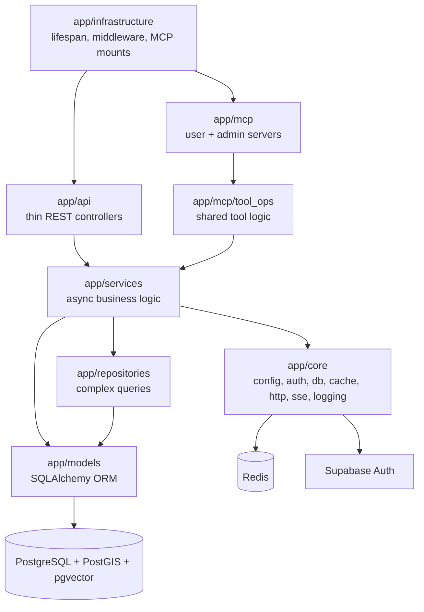

# Systems

Active contributors: Saksham, Ravi

This section documents the internal building blocks of the 360Ghar backend, the layers and subsystems that sit beneath the product features. Where the [features pages](../features/index.md) describe what users can do, the systems pages describe how the code is organized to deliver it: HTTP routing, business logic, persistence, infrastructural wiring, and cross-cutting concerns like auth, caching, and vector search.

The backend follows a layered architecture that runs from `app/infrastructure/` (composition root, lifespan, middleware, MCP mounts) down through `app/api/` (thin REST controllers), `app/services/` (async business logic, the largest layer), `app/repositories/` (complex queries), and `app/models/` (SQLAlchemy ORM). Cross-cutting code lives in `app/core/` (config, auth, db, cache, http, sse, logging). Two MCP servers (`/mcp`, `/mcp-admin`) and the AI agent both call into the shared service layer via `app/mcp/tool_ops/` and `app/services/ai_agent/tool_bridge.py`, so the service layer remains the single home for business rules.

## Pages

- [api-layer](api-layer.md) — REST surface: 333 endpoints across 38 modules, router composition, auth dependencies, OpenAPI tags.
- [services-layer](services-layer.md) — Async-first business logic, the service class pattern, AsyncSession injection, 50+ modules.
- [repositories](repositories.md) — `BaseRepository`, `PropertyRepository`, `PropertyQueryBuilder` (geospatial, full-text, filters).
- [models](models.md) — 68 ORM tables across 18 model files, 50+ enums, relationships, the `EnumStringType` adapter.
- [infrastructure](infrastructure.md) — Lifespan startup (cache, migrations, DNS prewarm, scheduler), graceful shutdown, middleware, exception handlers, MCP HTTP app construction.
- [core-cross-cutting](core-cross-cutting.md) — Config (Pydantic settings), auth (Supabase JWT, 503 on provider outage), database (async engine, NullPool serverless, background pool), shared httpx clients, flatmates realtime, structured logging, DB resilience.
- [vector-search](vector-search.md) — pgvector embeddings, hybrid vector+text scoring, the Gemini embedding client, sync scheduler, backfill.
- [cache-subsystem](cache-subsystem.md) — Memory, Redis, and disk backends, `CacheManager` facade, decorators, key generation, `PropertyCacheManager`.

## How the layers fit

Most feature work starts in `app/services/`, wires up an endpoint in `app/api/api_v1/endpoints/`, and adds a model in `app/models/` when new state is needed. The systems pages below tell you where each kind of change belongs.
