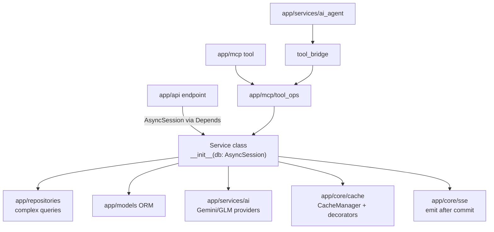

# Services layer

Active contributors: Saksham, Ravi

The services layer is where business logic lives. It is the largest layer in the codebase (50+ modules, including the largest file `app/services/user.py` at 951 lines) and the single home for rules shared by REST endpoints, MCP tools, and the AI agent. All services are async-first and inject `AsyncSession` via FastAPI dependencies, so database I/O never blocks the event loop.

The layer follows a service class pattern: each service takes an `AsyncSession` in its constructor and exposes async methods. Free functions are also common for stateless helpers (e.g. `get_user_by_phone`). Endpoints in `app/api/` are thin controllers that validate input, call a service method, and serialize the result.

## Directory layout

```
app/services/
├── core.py                         # CoreService (bugs, pages, app versions, FAQs)
├── user.py                         # User CRUD, account deletion, Supabase sync (951 lines)
├── property/                       # property/crud.py, search.py, recommendations.py, helpers.py
├── agent/                          # Agent service package
├── booking.py                      # 360 Stays bookings
├── visit.py                        # Property visit scheduling
├── swipe.py                        # Swipe interactions
├── blog.py                         # Blog CRUD + SEO fields
├── blog_auto_publish.py            # Auto-publish pipeline
├── blog_auto_publish_scheduler.py  # Blog cron registration
├── blog_service/                   # Blog content generator
├── cloudinary/                     # Cloudinary media service
├── media/                          # Media helpers
├── core.py
├── custom_domain.py                # Custom domain DNS verification
├── data_hub/                       # 26 scraper modules
├── data_hub_scheduler.py           # Data hub cron registration
├── email.py                        # Email service
├── flatmates/                      # conversations, helpers, interactions, matching, moderation, profiles, visits
├── image_processing.py             # Thumbnails, EXIF (Pillow)
├── notification_config.py          # NOTIFICATION_TYPES registry
├── notification_dispatcher.py      # Multi-channel dispatch
├── notification_scheduler.py       # Notification cron registration
├── notifications/                  # crud, fcm, helpers, push
├── oauth_token_store.py            # OAuth token/code storage via CacheManager
├── payments.py
├── pm_*.py                         # 12 PM service modules (leases, rent, maintenance, etc.)
├── push_notification.py            # FCM push dispatch
├── sms.py
├── storage/                        # Storage service package
├── storage_paths.py                # Upload path generation + sanitization
├── tour/                           # Tour service package
├── tour_ai/                        # Tour AI processing
├── tour_reel/
├── vector_sync_scheduler.py        # Vector sync cron registration
└── ai/                             # AI provider factory + providers + vastu + image_gen
```

## Key abstractions

| Abstraction | Example | Purpose |
|---|---|---|
| Service class | `class CoreService: def __init__(self, db: AsyncSession)` | Holds the session, exposes async methods |
| Free function | `async def get_user_by_phone(db, phone)` | Stateless helper that takes the session explicitly |
| 3-tuple return | `(items, next_cursor, has_more)` | Cursor pagination for list/search/recommendations |
| Background session | `AsyncSessionLocalBG` | Used by schedulers and SSE for non-request work |
| AI provider factory | `app/services/ai.get_ai_provider` | Gemini/GLM provider selection with retries |
| Shared tool logic | `app/mcp/tool_ops/` | Business logic reused by MCP servers and the AI agent |

## How it works



Services own the unit of work: they begin queries on the injected session, commit on success, and roll back on error. Flatmates user-visible state changes queue Supabase Realtime broadcasts via `queue_flatmates_realtime_event`, which publishes only after commit. List endpoints follow the recent cursor pagination refactor (June 2026): property list, search, recommendations, users, agents, bookings, visits, and blog all return `(items, next_cursor, has_more)` tuples.

## Integration points

- **Endpoints** in `app/api/api_v1/endpoints/` instantiate services with `Depends(get_db)`.
- **MCP servers** call the same services through `app/mcp/tool_ops/`, never re-implementing business rules. See [features/mcp-servers](../features/mcp-servers.md).
- **AI agent** routes tool calls through `app/services/ai_agent/tool_bridge.py` into `tool_ops`.
- **Schedulles** in `app/services/*_scheduler.py` register jobs on the shared scheduler; see [infrastructure](infrastructure.md).
- **Cache** is applied via `@cached` decorators and `PropertyCacheManager`; see [cache-subsystem](cache-subsystem.md).

## Entry points for modification

- New business rule: add a method to the relevant service (or a new service module), then call it from the endpoint, MCP tool, and AI agent tool bridge via `tool_ops`.
- New list endpoint: return a 3-tuple `(items, next_cursor, has_more)` and use `keyset_filter` / `keyset_payload` from `app/schemas/pagination.py`.
- New background job: register it on the shared scheduler via a `start_*_scheduler` function called from `app/infrastructure/lifespan.py`.

## Key source files

| File | Role |
|---|---|
| `app/services/user.py` | User CRUD, account deletion, Supabase sync |
| `app/services/property/crud.py` | Property CRUD with cache and repo integration |
| `app/services/property/search.py` | Property search (707 lines) |
| `app/services/core.py` | CoreService pattern reference |
| `app/services/booking.py` | 360 Stays bookings (overlapping bookings allowed) |
| `app/services/pm_authz.py` | PM authorization helpers |
| `app/services/notification_config.py` | `NOTIFICATION_TYPES` registry |
| `app/services/ai/` | AI provider factory, Gemini, GLM, vastu, image gen |
